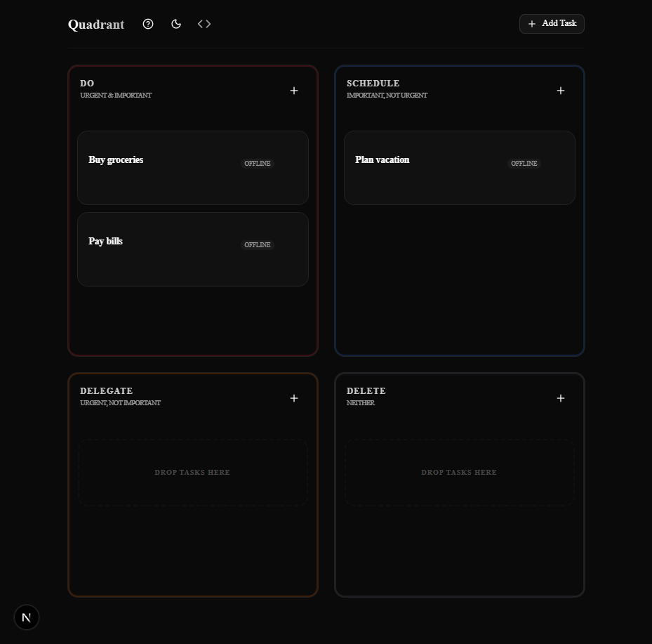

# Quadrant

A cross-device Eisenhower Matrix PWA built for frictionless capture and reliable offline-first sync.

## Live Link
🚀 **[View Live Site](https://time-pi-self.vercel.app/)**

## Features
- **Drag & Drop**: Seamlessly move tasks between quadrants or reorder them within a list.
- **Offline-First**: Powered by Dexie.js for reliable offline use and background sync with Supabase.
- **Dark Mode**: Support for light, dark, and system themes.
- **Accessible**: WCAG AA compliant with full keyboard navigation and screen reader support.

## Preview


## Tech Stack
- **Framework**: Next.js 15 (App Router)
- **Styling**: Tailwind CSS v4 + shadcn/ui (Base UI)
- **State Management**: Zustand + TanStack Query v5
- **Database**: Supabase + Dexie.js
- **Service Worker**: Serwist
- **Testing**: Vitest + Playwright

## Development

First, install dependencies:
```bash
pnpm install
```

Then, run the development server:
```bash
pnpm dev
```

## License
MIT
